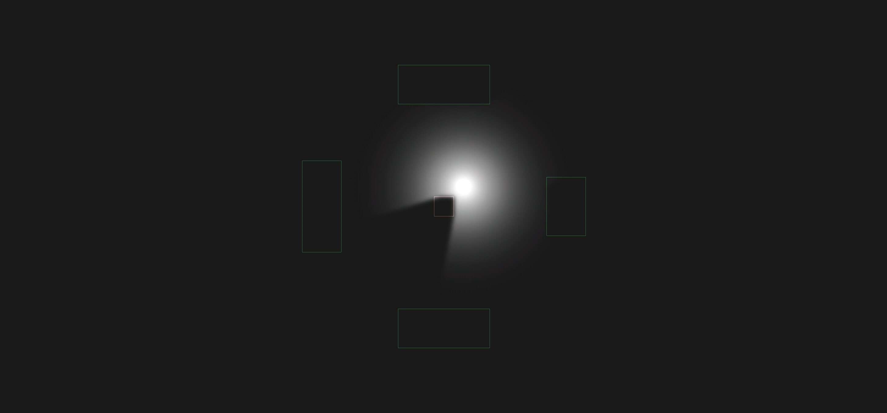
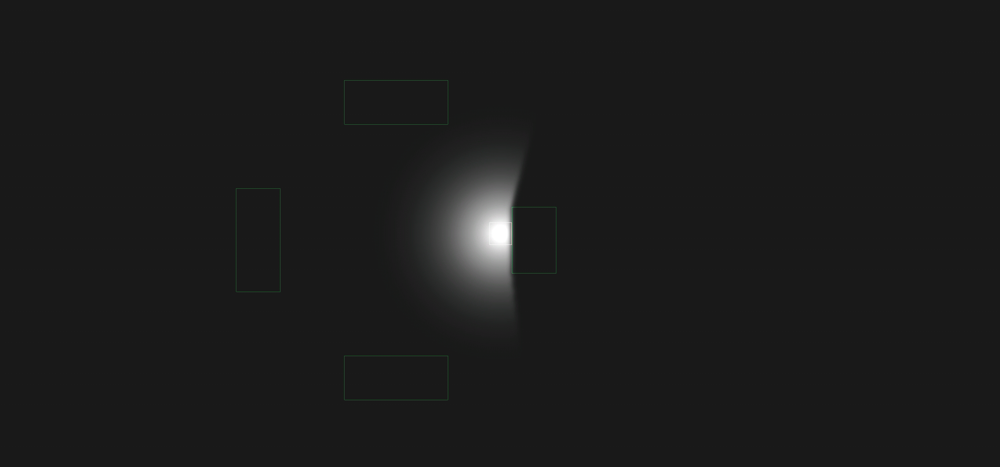
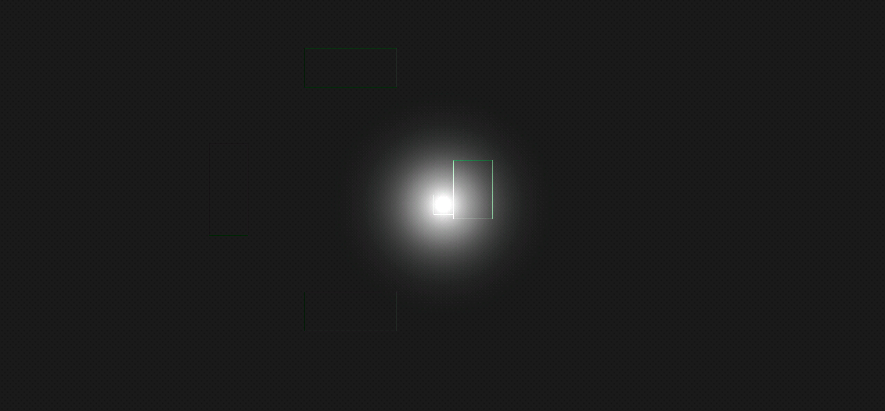

# Box2DLights 

Ejemplo de uso de la libreria Box2DLights en el cual se utiliza Android y LibGDX. En el ejemplo se utiliza RayHandler para la iluminacion principal 0f es ausencia de luz y 1f es completamente iluminado.

Se utiliza PointLight para la iluminacion por punto en el cual tiene diferentes configuraciones:
 
//Creacion de PointLight el cual requiere como parametro RayHandler, Numero de rayos, El color, Distancia de la luz y la posicion de inicio.
new PointLight(rayHandler, 50, Color.WHITE, 6, 1, 1);
 
//Respeta el area del objecto (en este ejemplo se utiliza para respetar el cuerpo del player)
pointLight.setSoftnessLength(0f);

Imagen sin SoftnessLength

Imagen con SoftnessLength

//Si es verdadero permite al sistema de luz pasar los objectos
pointLight.setXray(false);        

Imagen sin Xray

Imagen con Xray

//Realiza un seguimiento al objecto en cuestion (en este ejemplo es un cuadrado el cual lo sigue a donde se mueva)
pointLight.attachToBody(player);

